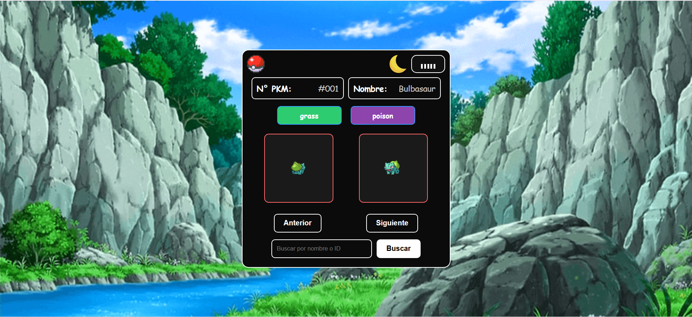
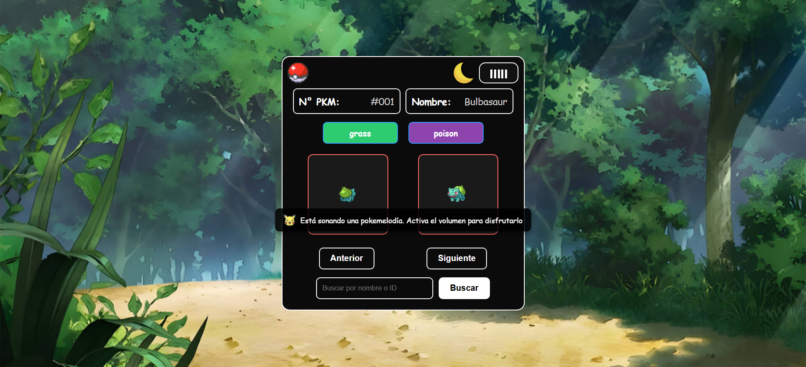
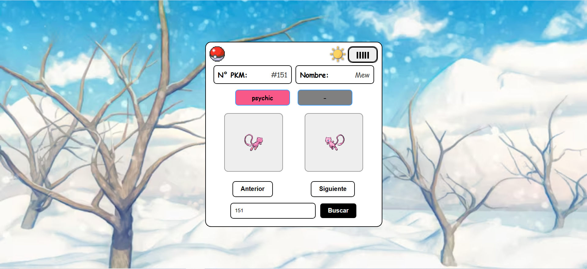

# Pokédex Web App

¡Bienvenido/a a mi proyecto Pokédex hecho con HTML, CSS y JavaScript!  
Una aplicación web que consume la [API oficial de Pokémon](https://pokeapi.co/) para mostrar información dinámica de cualquier Pokémon.

---

## Características principales

- Búsqueda por nombre o ID.
- Navegación entre Pokémon.
- Temas claro y oscuro con botón dinámico.
- Música de fondo que se activa al hacer interactuar con la app.
- Fondos que cambian automáticamente cada 10 segundos.
- Accesos directos de teclado y tooltips.
- Reinicio con logo de Pokéball.
- Animaciones suaves en el botón de música.

---

## Capturas del proyecto

<details>
<summary>Modo oscuro</summary>

  


</details>

<details>
<summary>Modo claro</summary>

  

</details>

<details>
<summary>Música y fondos rotativos</summary>

[Escuchar música de fondo](assets/musicapokemon1gen.mp3)


</details>

---

## Requisitos

- Un navegador moderno (Chrome, Firefox, Edge…)
- (Opcional) [Visual Studio Code](https://code.visualstudio.com/)
- (Opcional) Extensión [Live Server](https://marketplace.visualstudio.com/items?itemName=ritwickdey.LiveServer)

---

## Instalación paso a paso

**Clona este repositorio**
```bash
git clone https://github.com/AngelFeriaGarcia/Pokedex-app.git

---

## Tecnologías

* HTML5  
* CSS3 (Flexbox)  
* JavaScript (DOM, Fetch API)  
* PokéAPI – [https://pokeapi.co](https://pokeapi.co)

---

## ¿Te gustó el proyecto? ¿Quiéres valorarme?

Tu feedback es muy importante para seguir mejorando esta app.
Si te ha gustado este proyecto, puedes ayudarme de estas formas:

* Dándole una estrella al repositorio.  
* Dejando tu opinión, sugerencia o mejora en la sección de "Discussions", ¡lo agradeceré un montón para poder seguir mejorando, aprendiendo y evolucionando!.  
* Compartiendo el proyecto con otras personas interesadas en JavaScript y APIs.

[](https://github.com/AngelFeriaGarcia/Pokedex-app/stargazers)

[Comenta y deja tu reseña o comentario](https://github.com/AngelFeriaGarcia/Pokedex-app/discussions)